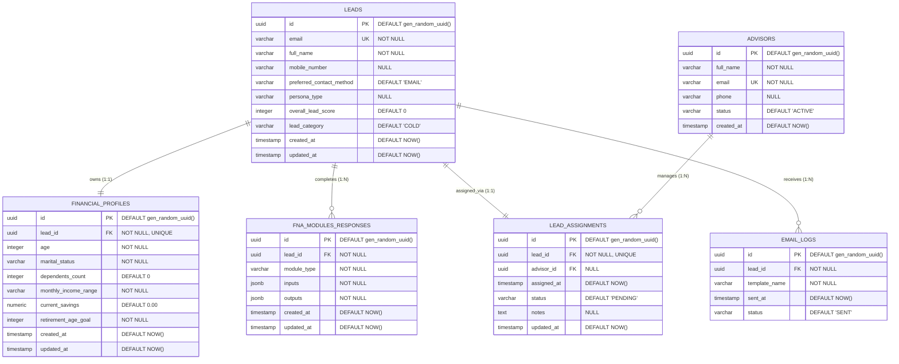

# **Project Kintsugi - Financial Needs Analysis (FNA) Lead-Generation Website - Project Documentation**

---

## **1. Project Overview & Objectives**

### **1.1 Project Purpose**
Project Kintsugi (the Financial Needs Analysis (FNA) Lead-Generation Website) is an interactive, high-conversion prospect acquisition platform. It is designed to attract, engage, and qualify potential clients seeking financial guidance by offering them personalized, immediate financial analysis. 
The system offers users access to a single free calculator module to demonstrate immediate value. To unlock the full, integrated dashboard containing the complete suite of calculators, a personalized persona evaluation, and a downloadable PDF summary, users must submit their contact information. This creates a "soft gate" that serves as a highly qualified lead funnel for financial advisors, agencies, and insurance consultants.

```
                  ┌─────────────────────────────────────────┐
                  │          Landing Page Visitor           │
                  └────────────────────┬────────────────────┘
                                       │
                                       ▼
                  ┌─────────────────────────────────────────┐
                  │      Selects & Uses 1 Free Module       │
                  └────────────────────┬────────────────────┘
                                       │
                                       ▼
                  ┌─────────────────────────────────────────┐
                  │        Views Initial Free Results       │
                  └────────────────────┬────────────────────┘
                                       │
                                       ▼
                  ┌─────────────────────────────────────────┐
                  │    Soft Gate: Enter Contact Details     │
                  └────────────────────┬────────────────────┘
                                       │
                                       ▼
                  ┌─────────────────────────────────────────┐
                  │       Unlocks Full FNA Dashboard        │
                  │   (All modules + PDF Report + Persona)  │
                  └────────────────────┬────────────────────┘
                                       │
                                       ▼
                  ┌─────────────────────────────────────────┐
                  │  Lead Assigned to Advisor & Emailed    │
                  └─────────────────────────────────────────┘
```

### **1.2 Business Goals and Success Criteria**
*   **Lead Generation Volume:** Generate a minimum of 1,000 qualified lead profiles (name, email, validated phone) per month within 90 days post-launch.
*   **Conversion Optimization:** 
    *   Achieve a landing-page-to-calculator-use rate of $\ge 40\%$.
    *   Achieve a calculator-use-to-lead-registration (email unlock) conversion rate of $\ge 15\%$.
*   **Advisor Enablement:** Convert $\ge 5\%$ of registered leads into scheduled consultation bookings with financial advisors.
*   **Data Integrity:** Maintain less than a 3% bounce rate on captured emails through real-time syntax and domain checks.
*   **Customer Trust:** Establish immediate trust by displaying dynamic, interactive projections instead of generic, non-interactive marketing copy.

### **1.3 In-Scope and Out-of-Scope Items**
#### **In-Scope:**
*   **Responsive Web Application:** Optimized for desktop, tablet, and mobile platforms.
*   **Five Calculator Modules:**
    1.  *Education Planning:* Calculates funding requirements for children's higher education.
    2.  *Retirement Planning:* Projects savings targets based on desired retirement age and lifestyle.
    3.  *Income Protection:* Analyzes the financial gap if the primary breadwinner is unable to work.
    4.  *Health Protection:* Estimates necessary coverage for critical illness and medical emergencies.
    5.  *Milestone Savings:* Evaluates targets for major purchases (e.g., house, wedding, business).
*   **Soft Gate Mechanism:** Input modal demanding Full Name, Email, and Mobile Number (optional) to transition from a single module to the main dashboard.
*   **Personalized FNA Dashboard:** Unified display of all modules, financial gap analysis, and interactive charts showing cumulative projections.
*   **PDF Generation Service:** Generates a professional, branded PDF summary containing all calculations, recommendations, and advisor contact details.
*   **Lead Scoring Engine:** Dynamic classification of leads (Hot, Warm, Cold) based on criteria like gap sizes, income, and dashboard interactions.
*   **Advisor Portal:** A secure dashboard where designated financial advisors can view assigned leads, read client financial inputs, and log contact attempts.
*   **Email Automation:** Integration with third-party systems to trigger immediate welcome, report delivery, and nurturing sequences.

#### **Out-of-Scope:**
*   **Direct E-commerce Transactions:** The website will not process insurance application payments, open investment accounts, or execute financial transactions.
*   **Direct Asset Management:** No live tracking of external stock portfolios or real-world bank account feeds (no Plaid integration in Phase 1).
*   **Multi-Currency Engine:** Calculations in Phase 1 are restricted to a single local currency base (₱ / PHP), though labels are configurable.
*   **Advisor Scheduling System:** The platform will redirect users to advisors' individual Calendly/scheduling links rather than building a custom booking scheduler.
*   **CRM Integrations:** No CRM (e.g., HubSpot) will be used for Phase 1 / proof of concept. Lead data will reside strictly in the PostgreSQL database.
*   **Third-Party Email Sync / Nurturing Campaigns:** No heavy integrations (e.g., Mailchimp) for phase 1. Transactional emails can be deferred or sent via a simple SMTP/SendGrid setup if needed.

### **1.4 Stakeholders and Roles**
*   **Solo Developer (PoC Creator):** Responsible for all aspects of development, configuration, testing, and deployment.
    *   **Local Development:** Developed on a local PC environment.
    *   **Deployments:** Responsible for containerizing the application using Docker and hosting it on a VPS.
    *   **Data Layer:** Configures PostgreSQL database schemas using Drizzle ORM.
    *   **Frontend / Backend:** Implements the Next.js UI elements, calculator math engines, and local cookie sessions.

### **1.5 Assumptions and Constraints**
*   **User Motivation:** We assume users are willing to disclose sensitive financial information (savings, income range) once they have experienced the value of a free interactive tool.
*   **Regulatory disclaimers:** The system must show clear disclosures stating that outputs are projections for educational purposes and do not constitute legal financial advice.
*   **Data Regulations:** The application must comply with local privacy regulations (e.g., GDPR, CCPA, and data privacy acts regarding consumer financial data).
*   **Technical Constraint:** The application runs in a Docker container on a VPS. Resource limitations depend on the VPS tier, removing strict 10-second serverless execution limits.

---

## **2. Architecture Overview**

### **2.1 High-Level System Architecture**
The application uses a unified architecture built on Next.js deployed inside Docker containers on a single VPS. The frontend is built using React components with client-side state management for live calculations, while backend API routes run in the Docker container and execute database operations, lead scoring, and PDF generation.

```mermaid
graph TD
    %% Define Nodes
    User([User / Prospect])
    Advisor([Financial Advisor])
    
    subgraph VPS_Host [VPS - Docker Container Host]
        subgraph NextJS_App [Next.js App Container]
            UI[Interactive UI / React Components]
            State[Local React State / Live Calculations]
            Charts[Recharts / Visual Projections]
            API[REST Endpoints]
            CalcEngine[FNA Calculation Validation Engine]
            ScoreEngine[Lead Scoring Engine]
            PDFGen[Puppeteer PDF Service]
        end
        
        subgraph Database_Layer [Database Container]
            DB[(PostgreSQL Database)]
        end
    end
    
    subgraph External_Services [Optional External Services]
        EmailAPI[SMTP / SendGrid API]
    end

    %% Define Connections
    User -->|Interacts| UI
    UI <-->|Updates| State
    State -->|Renders| Charts
    UI -->|JSON Request| API
    Advisor -->|Authenticated Access| UI
    
    API -->|Validate & Compute| CalcEngine
    API -->|Score Leads| ScoreEngine
    API -->|Query / Mutate (Drizzle)| DB
    
    API -->|Trigger PDF| PDFGen
    API -->|Trigger Dispatch| EmailAPI
    PDFGen -->|Delivered PDF| EmailAPI
```

### **2.2 Backend and Frontend Stack**
*   **Frontend Framework:** Next.js 14+ (App Router) with TypeScript.
*   **Styling & Design System:** Modern Vanilla CSS (using CSS variables, CSS grid/flexbox, CSS Modules) to ensure high rendering speeds and lightweight bundle sizes.
*   **State Management:** React Context API for managing the multi-step calculator answers and user progression.
*   **Data Visualization:** Recharts or Chart.js for rendering retirement projection graphs, income protective gaps, and milestone target lines.
*   **Backend Server:** Next.js API routes running in a Node.js Docker container on the VPS.
*   **Database ORM:** Drizzle ORM for lightweight, type-safe database queries and migrations.
*   **Database:** PostgreSQL (running in a Docker container on the VPS or developed locally).

### **2.3 Integrations**
*   **Email Automation (Optional / Simple):** Direct SMTP configuration or simple SendGrid API integration for sending transactional PDF emails.
*   **CRM Sync:** *None* (No CRM will be used for now to maintain PoC simplicity).
*   **PDF Generation:** Puppeteer-core running inside the Next.js Node container on the VPS (leveraging standard server capabilities).
*   **Web Analytics:** Google Analytics 4 (GA4) with custom events triggered on calculator start, gating modal display, gating submit, and PDF download.

### **2.4 Data Flow Diagrams**
The sequence diagram below displays how user input is processed, saved, and scored locally during the lead registration process:

```mermaid
sequenceDiagram
    autonumber
    actor User as User (Prospect)
    participant Front as Next.js Frontend
    participant API as API (/api/leads/register)
    database DB as PostgreSQL DB
    participant Score as Lead Scoring Engine
    participant Email as SMTP / SendGrid API

    User->>Front: Enters Name & Email in Gating Modal
    Front->>API: POST /api/leads/register {name, email, current_inputs}
    activate API
    
    API->>DB: Check if Lead Exists
    DB-->>API: (No existing user)
    
    API->>DB: Save Lead Profile & Inputs (via Drizzle)
    DB-->>API: Lead Record Created (ID: uuid)
    
    API->>Score: Calculate Lead Score (uuid)
    activate Score
    Score->>DB: Read inputs & module counts
    DB-->>Score: Inputs data
    Score->>Score: Run Scoring Matrix (Gaps, Income, Modules)
    Score-->>API: Return Score (e.g., 75) & Category (HOT)
    deactivate Score

    API->>DB: Update Lead with Score & Category
    DB-->>API: Saved
    
    API->>Email: Send Welcome Email + PDF Report (Optional for PoC)
    Email-->>API: Status Response
    
    API-->>Front: Return 200 OK { success: true, redirect: "/dashboard" }
    deactivate API
    Front->>User: Display Gated Dashboard & Charts
```

### **2.5 Infrastructure Notes**
*   **Hosting Platform:** Virtual Private Server (VPS) running Linux, with application services containerized using Docker and Docker Compose.
*   **Database Hosting:** PostgreSQL database container running locally inside the Docker network on the VPS, utilizing persistent volumes.
*   **Development Setup:** Developed locally on a PC environment with a local PostgreSQL database, then containerized and launched on the VPS.
*   **CI/CD & Deployment:** Semi-automated or simple git pull-and-restart scripts on the VPS for the proof-of-concept phase.
*   **Security & SSL:** Enforced via Nginx reverse proxy running on the VPS, configured with Let's Encrypt certificates using Certbot.

---

## **3. Entity Relationship Diagram (ERD)**

The following diagram defines the relational structure of the database tables, illustrating foreign key relationships, database constraints, and model connections:



---

## **4. Data Model Specification**

### **4.1 Table: leads**
*   **Description:** Stores the fundamental identity information, contact details, and marketing qualification data of the prospective client.
*   **Attributes:**
    *   `id` (UUID, Primary Key): Unique identifier, generated automatically.
    *   `email` (VARCHAR(255), Unique, Not Null): User's primary contact email.
    *   `full_name` (VARCHAR(255), Not Null): Combined first name and last name.
    *   `mobile_number` (VARCHAR(50), Nullable): Formatted phone number.
    *   `preferred_contact_method` (VARCHAR(50), Not Null): Default is `'EMAIL'`. Allowed values: `EMAIL`, `PHONE`, `SMS`, `WHATSAPP`.
    *   `persona_type` (VARCHAR(50), Nullable): Evaluated financial persona (e.g., `'Young Wealth Accumulator'`).
    *   `overall_lead_score` (INTEGER, Not Null): Score from 0 to 100 derived by the Lead Scoring Engine.
    *   `lead_category` (VARCHAR(20), Not Null): Defaults to `'COLD'`. Allowed values: `HOT`, `WARM`, `COLD`.
    *   `created_at` (TIMESTAMP, Not Null): Record creation date.
    *   `updated_at` (TIMESTAMP, Not Null): Record modification date.
*   **Indexing Recommendations:**
    *   Unique index on `email` (implicit).
    *   B-Tree index on `lead_category` for quick filtering on the advisor dashboard.
*   **Data Validation Rules:**
    *   `email` must match standard RFC 5322 validation expression.
    *   `overall_lead_score` must fall within `[0, 100]`.
    *   `lead_category` must match predefined enums.

### **4.2 Table: financial_profiles**
*   **Description:** Contains core financial baseline attributes needed to drive the individual calculation engines.
*   **Attributes:**
    *   `id` (UUID, Primary Key): Unique identifier.
    *   `lead_id` (UUID, Foreign Key, Unique, Not Null): References `leads(id)` on delete CASCADE constraint.
    *   `age` (INTEGER, Not Null): Current age of the user.
    *   `marital_status` (VARCHAR(20), Not Null): Allowed: `SINGLE`, `MARRIED`, `DIVORCED`, `WIDOWED`.
    *   `dependents_count` (INTEGER, Not Null): Number of financially dependent children/relatives.
    *   `monthly_income_range` (VARCHAR(50), Not Null): Bracket-based selector (e.g. `"₱30,000 - ₱50,000"`).
    *   `current_savings` (NUMERIC(15,2), Not Null): Baseline savings currently available.
    *   `retirement_age_goal` (INTEGER, Not Null): Target age for retirement.
*   **Validation Rules:**
    *   `age` must be $\ge 18$ and $\le 100$.
    *   `dependents_count` must be $\ge 0$.
    *   `retirement_age_goal` must be greater than current `age`.

### **4.3 Table: fna_modules_responses**
*   **Description:** Stores raw input and computed results for every individual module calculator filled by the user. Allows flexible expansion without database migration.
*   **Attributes:**
    *   `id` (UUID, Primary Key)
    *   `lead_id` (UUID, Foreign Key, Not Null): References `leads(id)` on delete CASCADE.
    *   `module_type` (VARCHAR(50), Not Null): E.g., `EDUCATION`, `RETIREMENT`, `INCOME_PROTECTION`, `HEALTH_PROTECTION`, `MILESTONE_SAVINGS`.
    *   `inputs` (JSONB, Not Null): Structured user input variables specific to the module.
    *   `outputs` (JSONB, Not Null): Calculation results, projection values, and gaps.
*   **Indexing Recommendations:**
    *   Composite index on `(lead_id, module_type)` for quick dashboard retrieval.
*   **Usage Notes:**
    *   JSON schema validation must be performed in application code to ensure the `inputs` and `outputs` payloads conform to the expected module interfaces.

### **4.4 Table: advisors**
*   **Description:** Directory of financial advisors registered to receive lead assignments.
*   **Attributes:**
    *   `id` (UUID, Primary Key)
    *   `full_name` (VARCHAR(255), Not Null)
    *   `email` (VARCHAR(255), Unique, Not Null)
    *   `phone` (VARCHAR(50), Nullable)
    *   `status` (VARCHAR(20), Not Null): Allowed: `ACTIVE`, `INACTIVE`.
*   **Validation Rules:**
    *   `status` defaults to `'ACTIVE'`.

### **4.5 Table: lead_assignments**
*   **Description:** Maps leads to dedicated advisors and tracks the follow-up pipeline status.
*   **Attributes:**
    *   `id` (UUID, Primary Key)
    *   `lead_id` (UUID, Foreign Key, Unique, Not Null): References `leads(id)` on delete CASCADE.
    *   `advisor_id` (UUID, Foreign Key, Nullable): References `advisors(id)` on delete SET NULL.
    *   `assigned_at` (TIMESTAMP, Not Null): Date assignment occurred.
    *   `status` (VARCHAR(20), Not Null): Allowed: `PENDING`, `CONTACTED`, `CONVERTED`, `LOST`.
    *   `notes` (TEXT, Nullable): Log of communications.
*   **Indexing Recommendations:**
    *   Index on `advisor_id` and index on `status`.

### **4.6 Table: email_logs**
*   **Description:** Tracks triggered emails for verification and audit trails.
*   **Attributes:**
    *   `id` (UUID, Primary Key)
    *   `lead_id` (UUID, Foreign Key, Not Null): References `leads(id)` on delete CASCADE.
    *   `template_name` (VARCHAR(100), Not Null): E.g., `welcome_fna_report`, `nurture_gap_explanation`.
    *   `sent_at` (TIMESTAMP, Not Null): Timestamp of API dispatch.
    *   `status` (VARCHAR(20), Not Null): Allowed: `SENT`, `DELIVERED`, `OPENED`, `CLICKED`, `FAILED`.

---

## **5. Coding Standards & Conventions**

### **5.1 Naming Conventions**
*   **TypeScript/JavaScript:**
    *   File names: PascalCase for React components (e.g., `RetirementCalculator.tsx`), camelCase for hooks, utilities, and routes (e.g., `useCalculatorState.ts`).
    *   Variables and Functions: camelCase (e.g., `calculateGapAmount()`).
    *   Interfaces & Types: PascalCase prefixed with 'I' or standard typing names (e.g., `ILeadData`).
*   **Database Schema:**
    *   Tables and Columns: Lowercase snake_case (e.g., `fna_modules_responses`, `lead_id`).
*   **API Routes:**
    *   URL routes: Lowercase kebab-case (e.g., `/api/lead-scoring/calculate`).

### **5.2 Folder Structure**
The project code organization complies with modern Next.js conventions, adapted for Drizzle ORM and Docker:

```
fna/
├── docker/
│   ├── Dockerfile                # Next.js Docker instructions
│   └── docker-compose.yml        # Docker compose configuration (App + DB)
├── public/
│   ├── assets/                   # Static images, icons, logos
│   └── documents/                # PDF templates or assets
├── src/
│   ├── app/
│   │   ├── api/
│   │   │   ├── calculate/
│   │   │   │   └── route.ts      # Core inputs math engine API
│   │   │   ├── leads/
│   │   │   │   ├── route.ts      # Lead creation API
│   │   │   │   └── score/
│   │   │   │       └── route.ts  # Scoring Trigger API
│   │   │   └── advisor/
│   │   │       └── route.ts      # Lead assignment / notes management
│   │   ├── dashboard/
│   │   │   └── page.tsx          # Gated User Dashboard
│   │   ├── advisor-portal/
│   │   │   └── page.tsx          # Advisor lead view and routing
│   │   ├── layout.tsx            # Global layout wrapper
│   │   └── page.tsx              # Public Landing Page & Free module selector
│   ├── components/
│   │   ├── ui/                   # Reusable components (buttons, cards, inputs)
│   │   ├── calculators/          # Individual calculator components
│   │   │   ├── Retirement.tsx
│   │   │   ├── Education.tsx
│   │   │   └── IncomeProtection.tsx
│   │   └── charts/               # Visualization rendering files (Recharts wrapper)
│   ├── db/
│   │   ├── index.ts              # Drizzle client initiator
│   │   ├── schema.ts             # Drizzle database schemas
│   │   └── migrations/           # Drizzle migrations output directory
│   ├── lib/
│   │   ├── scoring.ts            # Scoring rules and arithmetic
│   │   ├── formulas/             # Math engines (future projection logic)
│   │   └── pdf/                  # PDF report compiler utility
│   ├── styles/
│   │   ├── globals.css           # Global typography, resets, CSS tokens
│   │   └── components.css        # Shared component visual designs
│   └── types/
│       └── index.ts              # TypeScript interfaces files
├── drizzle.config.ts             # Drizzle ORM configuration
├── package.json
└── tsconfig.json
```

### **5.3 API Response Format**
Standardized JSON structures are required across all routes:

#### **Success Response Format:**
```json
{
  "success": true,
  "data": {
    "lead_id": "8b525f23-cfdf-4824-be00-b6058e0a30b4",
    "persona": "Milestone-Driven Builder",
    "lead_category": "HOT"
  }
}
```

#### **Error Response Format:**
```json
{
  "success": false,
  "error": {
    "code": "VALIDATION_FAILED",
    "message": "The retirement target age must be greater than current age.",
    "details": [
      {
        "field": "retirement_age_goal",
        "issue": "Must be greater than profile current age (35)."
      }
    ]
  }
}
```

### **5.4 Error Handling Strategy**
*   **Frontend Error Handling:** Wrap core UI parts in React Error Boundaries to prevent total page crashes. Capture client runtime validation errors before making server requests.
*   **Backend Error Handling:** Implement global Try-Catch blocks in server routes. Map internal database errors (e.g., duplicate email) to public validation errors without leaking relational schema details or server stack traces.

### **5.5 Logging and Monitoring Approach**
*   **Local logs:** Use `winston` for systematic output logging.
*   **Log Levels:** Use `error` for database disconnects or integration timeouts, `warn` for validation failures, and `info` for successful lead generation sequences.
*   **Production Monitoring:** Simple Docker container logs (`docker logs`) checkable on the VPS, potentially integrated with Sentry or lightweight error tracking if needed for the PoC.

---

## **6. Security & Compliance**

### **6.1 Authentication & Authorization Model**
*   **User/Lead Access:** Users do not need passwords to register. Once the soft gate email is submitted, a cryptographically signed JSON Web Token (JWT) is generated and stored in a secure `HttpOnly`, `SameSite=Strict`, `Secure` cookie. This token authorizes access to the user's dashboard during their browser session.
*   **Advisor Portal Access:** Financial advisors and administrators log in via NextAuth.js configured with Google OAuth or custom credentials.
*   **API Security:** All API routes (under `/api/advisor/*`) require verification of the advisor session JWT.

### **6.2 Data Privacy Considerations**
*   **Consent Management:** Checkbox for explicit consent must be checked by user prior to form submission, explaining data usage for evaluation and marketing contact.
*   **GDPR Right to be Forgotten:** Provide a database purge script. If a user requests deletion, their `leads` record is removed, automatically deleting related data across `financial_profiles` and `fna_modules_responses` via database cascades.
*   **Data in Transit:** All traffic is strictly redirected to HTTPS (TLS 1.3 enforced).

### **6.3 Backup & Recovery Strategy**
*   **Automatic Backups:** Configured daily automated backups on the VPS using `pg_dump` mapped to cron jobs, saving dumps to a secure backup directory.
*   **Recovery:** Database restoration accomplished by loading SQL backup dumps into the PostgreSQL container.

### **6.4 Access Control Matrix**

| Role | Public Landing | Use 1 Free Calculator | Access Gated Dashboard | View Assigned Leads | View All Analytics | Edit System Config |
| :--- | :---: | :---: | :---: | :---: | :---: | :---: |
| **Anonymous User** | ✓ | ✓ | ✗ | ✗ | ✗ | ✗ |
| **Registered Lead** | ✓ | ✓ | ✓ (Own Data Only) | ✗ | ✗ | ✗ |
| **Financial Advisor** | ✓ | ✗ | ✗ | ✓ (Assigned Only) | ✗ | ✗ |
| **Administrator** | ✓ | ✗ | ✗ | ✓ (All) | ✓ | ✓ |

### **6.5 Sensitive Data Handling**
*   **Database Encryption:** Storage is encrypted at rest using AES-256 standards.
*   **Log Masking:** Ensure phone numbers and email strings are masked in system output logs to prevent leaking Personally Identifiable Information (PII) to log aggregators.

---

## **7. Project Phases**

```
 ┌─────────────────────────────────────────────────────────────────────────┐
 │ Phase 1: Local Development & Architecture Setup (Days 1-4)               │
 └────────────────────────────────────┬────────────────────────────────────┘
                                      │
                                      ▼
 ┌─────────────────────────────────────────────────────────────────────────┐
 │ Phase 2: MVP Prototype & Gated Flow (Days 5-8)                          │
 └────────────────────────────────────┬────────────────────────────────────┘
                                      │
                                      ▼
 ┌─────────────────────────────────────────────────────────────────────────┐
 │ Phase 3: Core Calculators, PDF Engine & Scoring (Days 9-11)             │
 └────────────────────────────────────┬────────────────────────────────────┘
                                      │
                                      ▼
 ┌─────────────────────────────────────────────────────────────────────────┐
 │ Phase 4: Containerization, Testing & VPS Launch (Days 12-14)            │
 └─────────────────────────────────────────────────────────────────────────┘
```

### **Phase 1: Local Development & Architecture Setup (Days 1-4)**
*   **Objectives:** Set up local Next.js repository, Docker environment (including local PostgreSQL), and configure Drizzle ORM schemas.
*   **Deliverables:** Functioning local environment, Drizzle schemas for leads and calculation logs, and initialized UI design tokens.
*   **Dependencies:** Confirming calculation formulas.
*   **Risks:** Drizzle setup configuration mistakes can delay early database tasks.

### **Phase 2: MVP Prototype & Gated Flow (Days 5-8)**
*   **Objectives:** Build landing page interface, Retirement planning module (1st free module), and gating login (gated modal capture + local session cookies).
*   **Deliverables:** Landing page, Retirement Calculator, gating form, and session validation API.
*   **Dependencies:** Database schemas completed.
*   **Risks:** Session cookie setup or page gating logic issues.

### **Phase 3: Core Calculators, PDF Engine & Scoring (Days 9-11)**
*   **Objectives:** Implement secondary calculators (Milestones, Education, Health, Income), combine outputs on user Dashboard, write basic Lead Scoring logic, and construct PDF generation.
*   **Deliverables:** All 5 calculators functional, consolidated user Dashboard, Lead Scoring database columns, and Puppeteer PDF API.
*   **Dependencies:** MVP prototype validated.
*   **Risks:** PDF generation performance issues or layout styling challenges on VPS.

### **Phase 4: Containerization, Testing & VPS Launch (Days 12-14)**
*   **Objectives:** Finalize Docker Compose files, perform mathematical audits, configure VPS domain/SSL, and run production containers on the VPS.
*   **Deliverables:** Docker Compose configuration, production VPS deployment, SSL-active URL, and smoke test checks.
*   **Dependencies:** All core features built.
*   **Risks:** DNS redirection or Docker container connection issues on VPS.

---

## **8. Task Breakdown & Timeline**

This timeline maps out a compressed 2-week implementation schedule optimized for a solo developer constructing a proof of concept:

### **Week 1: Core Framework, Data Models & MVP**
*   **Task 1.1:** Setup Next.js repository, Docker Compose configurations (App container & local PostgreSQL), and configure Drizzle ORM (Day 1-2).
*   **Task 1.2:** Design responsive layouts for the landing page and gating states (Day 2).
*   **Task 1.3:** Build responsive Landing Page and the Retirement Module (first free calculator) with client-side interactive states (Day 3-4).
*   **Task 1.4:** Create lead registration API endpoint (`/api/leads/register`), database persistence logic via Drizzle, and session JWT cookie gating mechanics (Day 4-5).

### **Week 2: Calculators, PDF Engine & VPS Deployment**
*   **Task 2.1:** Build UI and formulas for secondary calculators: Education, Income Protection, Health, and Milestones (Day 6-7).
*   **Task 2.2:** Build user Dashboard page showing aggregated gap analyses and cumulative graphs (Day 8).
*   **Task 2.3:** Develop basic Lead Scoring helper and PDF Generation logic using Puppeteer (Day 9-10).
*   **Task 2.4:** Build basic Advisor Portal dashboard for lead viewing (Day 11).
*   **Task 2.5:** Run local mathematical calculations check, prepare production Docker Compose configuration, transfer project files to VPS (Day 12-13).
*   **Task 2.6:** Pull database schemas/migrations, start Docker services on VPS, bind domain, configure SSL via Nginx reverse proxy, and conduct live smoke tests (Day 13-14).

---

## **9. Completed Tasks**

### **9.1 Planning & Initialization**
*   **Requirement Gathering:** Aligned on a simple, rapid-launch proof-of-concept scope containing the 5 main calculators.
*   **Tech Stack Alignment:** Decided on Next.js, Drizzle ORM, PostgreSQL, Docker/docker-compose, and hosting on a VPS.
*   **Documentation Initialization:** Created this core Project Documentation and Project Plan drafts.
*   **Completion Date:** 2026-07-08.
*   **Blockers Encountered:** None.
*   **Impact on next phases:** Establishes the development standards and architectural paths for the project lifecycle.

---

## **10. Next Steps & Future Improvements**

### **10.1 Key Next Steps**
1.  Complete the technical specification sheet detailing the mathematical logic for the four secondary calculators (Education funding inflation, life milestone compound interest, health gap estimates, and income protection replacement rules).
2.  Design code mockups for the landing page structure and the gating modal.
3.  Establish the Next.js workspace repository and initiate database connections.

### **10.2 Future Roadmap Enhancements**
*   **Interactive Scenario Comparison:** Allow users to contrast different financial strategies (e.g., retiring at 55 with lower spending vs. retiring at 65 with higher savings) on their dashboard.
*   **Financial Persona Assessment:** Implement a short questionnaire that classifies users into personas (e.g., "Wealth Accumulator," "Security Seeker") to tailor follow-up marketing sequences.
*   **Interactive Gamification:** Introduce progress indicators, financial wellness score levels, and goal milestone alerts.
*   **Live Booking Sync:** Integrate calendar availability directly into the dashboard to allow scheduling consultations with assigned advisors.
*   **Automated SMS Nurturing:** Connect SMS channels (e.g., Twilio API) to send short advice updates and consultation reminders.

---

## **11. Acceptance Criteria**

### **11.1 Major Deliverable: Gated Calculator Flow**
*   **Definition of "Done":**
    *   An anonymous user can load the landing page and complete one calculator module.
    *   The calculator displays a summary output containing at least one chart.
    *   Prompting the user to view other modules displays the gating modal.
    *   Entering name and email opens the dashboard containing all five calculators.
*   **Validation Method:** Manual verification of the user flow on desktop and mobile.
*   **Sign-Off Owner:** Product Manager / Executive Sponsor.

### **11.2 Major Deliverable: Calculation Engine**
*   **Definition of "Done":**
    *   Calculated results (gaps, retirement projection values) must match the baseline calculations of the reference spreadsheet.
    *   Inputs containing letters or symbols must be handled gracefully by UI validations.
*   **Validation Method:** Automated tests verifying 50 financial input scenarios against expected outputs.
*   **Sign-Off Owner:** Financial Advisor Lead / QA Specialist.

### **11.3 Major Deliverable: Lead Scoring & Local Storage**
*   **Definition of "Done":**
    *   Submitting a lead record computes the correct lead category (Hot/Warm/Cold) and saves it to the local PostgreSQL database via Drizzle ORM.
*   **Validation Method:** Check database records to verify populated lead categories.
*   **Sign-Off Owner:** Solo Developer / Creator.

---

## **12. Change Management**

### **12.1 Requirement Changes**
*   Any request to modify features or calculator math must be documented in a Change Request.
*   The project architect and sponsor must evaluate the change's impact on project costs and launch timelines before approval.

### **12.2 Version Control Workflow**
*   The project uses Git. The default branch is `main` (production).
*   All updates are developed on feature branches named `feature/description` or `bugfix/description`.
*   Merging to `main` requires a Pull Request, a successful automated build check, and review approval from at least one core developer.

### **12.3 Documentation Updates**
*   This document serves as the project's source of truth.
*   Updates to schemas, APIs, or project scope must be reflected in this file during development.

---

## **13. Testing Strategy**

### **13.1 Unit Testing**
*   **Framework:** Vitest.
*   **Scope:** Focus on calculation utility engines (e.g., `retirementEngine.ts`). Run tests on various scenarios to verify correct mathematical outputs.

### **13.2 Integration Testing**
*   **Scope:** Test REST API endpoints. Verify that POST requests write correct records to the database and generate correct API responses.

### **13.3 End-to-End (E2E) Testing**
*   **Framework:** Playwright.
*   **Scope:** Validate the complete user journey: Landing page $\rightarrow$ Retirement Calculator $\rightarrow$ Gating Modal submit $\rightarrow$ Gated Dashboard render.

### **13.4 Load & Performance Testing**
*   **Framework:** k6.
*   **Scope:** Simulate 100 concurrent users accessing calculators and submitting emails. Ensure the database connection pool handles the traffic and serverless routes execute within 2 seconds.

### **13.5 User Acceptance Testing (UAT)**
*   **Scope:** Internal stakeholders and five trial financial advisors will review the application. They will evaluate usability, dashboard navigation, and lead assignment routing before launch.

---

## **14. Deployment Checklist**

### **14.1 Pre-Deployment Steps**
1.  Verify that Drizzle database schemas compile correctly.
2.  Create production environment files (`.env.production`) on the VPS containing database passwords and secret keys.
3.  Build and test Docker containers locally to guarantee compilation success.
4.  Configure Nginx reverse proxy configuration on VPS for routing HTTP requests to the docker container and handling Certbot SSL generation.

### **14.2 Environment Configuration (Required Variables)**
*   `DATABASE_URL`: Primary PostgreSQL connection string pointing to the VPS database container.
*   `NEXTAUTH_SECRET`: Secret key for session encryption.
*   `NEXT_PUBLIC_APP_URL`: Production URL of the VPS.

### **14.3 Rollback Plan**
*   **Application code:** Rebuild and start the previous Docker container image using stable Git tags/hashes.
*   **Database:** Apply previous Drizzle migration schemas, or restore database state from the most recent daily `pg_dump` sql dump file.

### **14.4 Post-Deployment Verification**
*   Verify that the production landing page loads correctly.
*   Run a test lead registration flow and verify lead record creation in the PostgreSQL database.
*   Access the Advisor Portal to confirm that the test lead displays properly in the list.

---

## **15. Glossary**

*   **FNA (Financial Needs Analysis):** A systematic evaluation of an individual's current financial situation, future goals, and areas of protection gap.
*   **Soft Gate:** A registration screen that prompts the user to enter contact details to view premium content, while allowing access to initial content for free.
*   **Protection Gap:** The difference between a user's required financial coverage (e.g., life, health, income insurance) and their existing resources.
*   **Lead Scoring Engine:** An algorithm that analyzes a lead's financial inputs and site activity to assign a score, indicating their likelihood to buy.
*   **Hot Lead:** A lead with significant protection gaps, higher income brackets, and high engagement levels.
*   **Advisor Portal:** A secure dashboard that allows advisors to view, claim, and log follow-up actions for leads.
*   **PII (Personally Identifiable Information):** Sensitive data (like names, emails, and phone numbers) that can be used to identify an individual.

---

## **16. Project Tracking Plan**

### **16.1 Tracking Cadence**
*   **Daily Check-in:** Self-tracking of tasks completed and blockers via Git commit messages and personal board updates.
*   **Weekly Milestones review:** Review progress against the 2-week PoC timeline to identify potential delays.

### **16.2 Communication Channels**
*   **Git Commit Messages:** Track code progress and major fixes.
*   **Local Documentation (this file):** Updated to reflect the actual state and completed tasks.
