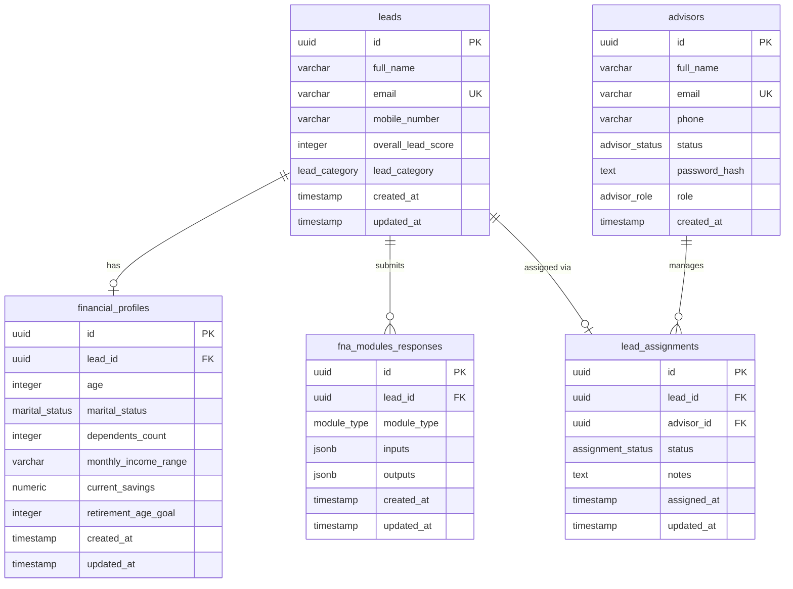
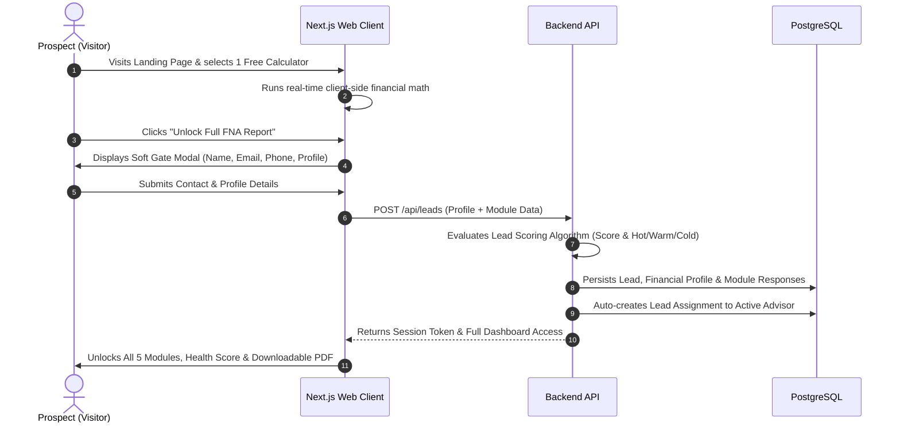
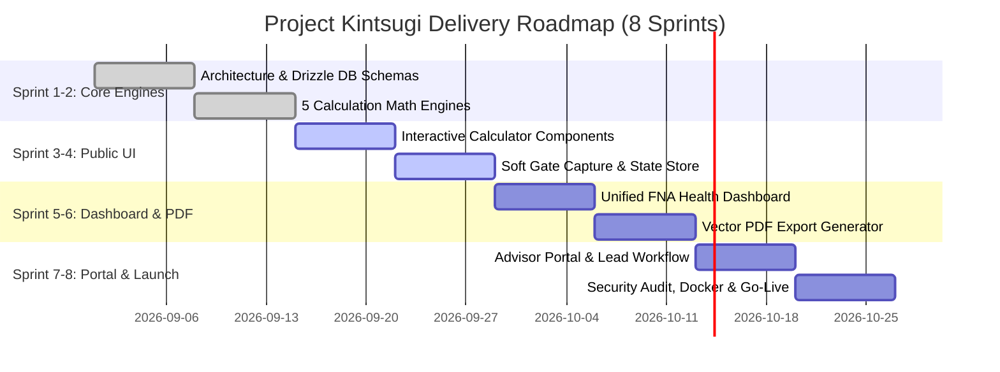

# Project Plan & Engineering Blueprint — Project Kintsugi
## Financial Needs Analysis (FNA) Lead-Generation Platform
**Document Version:** 1.0 (Comprehensive Engineering Blueprint)  
**Target Delivery Window:** 8-Week Phased Rollout  
**Last Updated:** September 2026

---

## 1. Executive Summary & Project Charter

### 1.1 Business Context & Problem Statement
In the financial advisory and insurance sector, prospecting often suffers from low conversion rates due to static landing pages, intrusive upfront lead forms, and generic marketing copy. Potential clients are hesitant to share contact information without receiving immediate, tangible value.
* **Low Visitor Engagement**: Static text fails to communicate personalized financial gaps.
* **High Form Friction**: Upfront multi-field registration forms create massive drop-offs before users see any calculation results.
* **Unqualified Lead Volume**: Financial advisors receive unqualified leads without context on income, dependents, or specific financial planning goals (Education, Retirement, Protection).
* **Delayed Advisor Response**: Absence of a dynamic lead scoring system leaves high-value prospects unprioritized.

**Project Kintsugi** delivers the **Financial Needs Analysis (FNA) Platform** — an interactive, value-first prospect acquisition system. Visitors can freely use a standalone financial calculator module (Education, Retirement, Income Protection, Health Protection, or Milestone Savings). Once value is demonstrated, a low-friction "Soft Gate" captures contact details to unlock the unified multi-module FNA Dashboard, comprehensive financial health scoring, and a downloadable PDF report, simultaneously routing the qualified lead to advisors.

### 1.2 Project Vision & Core Business Objectives
* **Value-First Soft Gate Funnel**: Achieve a $\ge 40\%$ visitor-to-calculator interaction rate and a $\ge 15\%$ calculator-to-lead conversion rate.
* **Comprehensive Multi-Module Suite**: Offer 5 interactive financial calculators running dynamic future value, annuity, and capital need formulas.
* **Automated Lead Scoring Engine**: Automatically categorize prospects as `HOT`, `WARM`, or `COLD` based on income, gap magnitude, and engagement depth.
* **Advisor Management Portal**: Provide a protected workspace for financial advisors to manage assigned leads, view detailed module responses, and track outreach status (`PENDING`, `CONTACTED`, `CONVERTED`, `LOST`).
* **Instant Branded PDF Reports**: Generate synchronous vector PDF summaries containing client gap breakdowns and advisor branding.

### 1.3 Scope Boundary Matrix

```
+----------------------------------------------------+---------------------------------------------------+
|               In Scope (Phase 1)                   |               Out of Scope (Phase 2)              |
+----------------------------------------------------+---------------------------------------------------+
| * 5 Interactive Financial Calculator Modules       | * Live External Bank Feeds / Plaid Integration    |
|   (Education, Retirement, Income, Health, Savings) | * In-App Insurance Policy Application & Payments  |
| * Dynamic Client-Side Compound Interest Engines    | * Real-time Stock / Crypto Portfolio Tracking     |
| * Low-Friction Soft Gate Registration Modal        | * Multi-Currency Conversions (Locked to PHP base) |
| * Unified Multi-Module Financial Dashboard         | * Automated In-App Appointment Scheduler Engine   |
| * Automated Lead Scoring Algorithm (Hot/Warm/Cold) |   (External Calendly links used instead)          |
| * Advisor Authentication & Protected Portal        | * Direct Third-Party CRM Sync (e.g. Salesforce)   |
| * Lead Assignment & Outreach Status Tracking       | * Complex Multi-Tenant White-Labeling             |
| * Synchronous Vector PDF Summary Generation        | * Native iOS / Android Binary Apps                |
| * Single-Container Dockerized VPS Deployment       |                                                   |
+----------------------------------------------------+---------------------------------------------------+
```

### 1.4 Stakeholder & RACI Matrix

| Role / Persona | Description | Project Responsibilities |
| :--- | :--- | :--- |
| **Executive Sponsor** | Agency Principal / Financial Director | Business strategy, compliance oversight, budget approval. (Accountable) |
| **Financial Advisor** | Licensed Insurance & Investment Consultant | Lead follow-up, client consultations, status updates in portal. (Responsible/Informed) |
| **Guest Prospect / User** | Individual Seeking Financial Guidance | Engages with calculators, unlocks full profile, downloads report. (Informed) |
| **Lead Developer** | Full-Stack Architect & Engineer | Architecture, Next.js frontend/backend, Drizzle ORM schemas, Docker deployment. (Responsible) |
| **Compliance Officer** | Legal & Regulatory Auditor | Disclaimers review, data privacy adherence (GDPR/DPA). (Consulted) |

---

## 2. System Architecture & Tech Stack

### 2.1 High-Level Architecture Diagram

```mermaid
flowchart TD
    subgraph Client Tier
        Visitor[Guest / Prospect User]
        AdvisorUser[Licensed Financial Advisor]
    end

    subgraph Application Tier (Next.js 16 App Router)
        Landing[Landing Page & Interactive Calculators]
        SoftGate[Soft Gate Lead Capture Modal]
        Dashboard[Unified FNA Results Dashboard]
        AdvisorPortal[Advisor Lead Management Portal]
        PDFService[Vector PDF Generator Service]
        ScoringEngine[Dynamic Lead Scoring Engine]
        AuthJWT[JWT Session & Cookie Authenticator]
    end

    subgraph Data Tier
        Postgres[(PostgreSQL Relational DB)]
        Drizzle[Drizzle ORM Engine]
    end

    Visitor --> Landing
    Landing --> SoftGate
    SoftGate --> Dashboard
    Dashboard --> PDFService
    SoftGate --> ScoringEngine
    
    AdvisorUser --> AdvisorPortal
    AdvisorPortal --> AuthJWT
    
    ScoringEngine --> Drizzle
    AdvisorPortal --> Drizzle
    Dashboard --> Drizzle
    Drizzle --> Postgres
```

### 2.2 Technology Stack

| Layer | Technology Selected | Technical Rationale |
| :--- | :--- | :--- |
| **Frontend Framework** | **Next.js 16 (React 19, App Router)** | Server Components for advisor portal security; fast client-side reactivity for real-time slider math. |
| **Styling & Design** | **Tailwind CSS v4 & Lucide Icons** | Ultra-responsive layout with modern glassmorphic tokens and accessible financial charts. |
| **Database** | **PostgreSQL 16** | Robust relational integrity, JSONB support for dynamic module inputs/outputs, and ACID guarantees. |
| **ORM & Migrations** | **Drizzle ORM & Drizzle Kit** | Type-safe SQL-like queries, zero-overhead execution, and declarative schema migrations. |
| **Authentication** | **Custom AES-GCM JWT & Scrypt** | Secure HTTP-only cookie-based sessions for advisors with strict same-site and cryptographic salt verification. |
| **PDF Generation** | **Custom Zero-Dependency Engine** | Synchronous vector stream rendering with zero headless browser (Puppeteer) memory footprint. |
| **Containerization** | **Docker & Docker Compose** | Portable, reproducible production deployment for single VPS environments. |

---

## 3. Database Schema Design & ERD

### 3.1 Entity Relationship Diagram (ERD)



### 3.2 Data Dictionary

1. **`leads`**: Master prospect contact records.
   * `id` (UUID, PK): Auto-generated unique identifier.
   * `full_name` (VARCHAR(255), Not Null): Prospect's complete name.
   * `email` (VARCHAR(255), Unique, Not Null): Validated contact email.
   * `mobile_number` (VARCHAR(20), Nullable): Contact phone number.
   * `overall_lead_score` (INTEGER, Default 0): Calculated score (0–100).
   * `lead_category` (ENUM: `HOT`, `WARM`, `COLD`): Urgency tier.

2. **`financial_profiles`**: Demographics and baseline financial capacity.
   * `lead_id` (UUID, FK -> `leads.id`, Cascade Delete): 1-to-1 linkage.
   * `age` (INTEGER, Not Null): Current age (18–80).
   * `marital_status` (ENUM: `SINGLE`, `MARRIED`, `DIVORCED`, `WIDOWED`).
   * `dependents_count` (INTEGER, Not Null): Number of dependents.
   * `monthly_income_range` (VARCHAR(50), Not Null): Stated bracket.
   * `current_savings` (NUMERIC(15,2), Not Null): Liquid savings capital.
   * `retirement_age_goal` (INTEGER, Not Null): Desired retirement age.

3. **`fna_modules_responses`**: Granular calculation snapshots per module.
   * `lead_id` (UUID, FK -> `leads.id`): Associated lead.
   * `module_type` (ENUM: `EDUCATION`, `RETIREMENT`, `INCOME_PROTECTION`, `HEALTH_PROTECTION`, `MILESTONE_SAVINGS`).
   * `inputs` (JSONB): Form payload (inflation rates, years, target amounts).
   * `outputs` (JSONB): Computed metrics (shortfall, required savings/mo).

4. **`advisors` & `lead_assignments`**: Advisor accounts and lead routing.
   * Advisor statuses: `ACTIVE`, `INACTIVE`. Roles: `ADMIN`, `ADVISOR`.
   * Assignment statuses: `PENDING` (new), `CONTACTED` (in discussion), `CONVERTED` (closed), `LOST` (unresponsive).

---

## 4. User Journey & State Workflows

### 4.1 Prospect Conversion Funnel (Soft Gate Workflow)



---

## 5. Work Breakdown Structure (WBS) & Milestones



---

## 6. Risk Management Matrix

| Risk ID | Risk Description | Severity | Likelihood | Mitigation Strategy |
| :--- | :--- | :---: | :---: | :--- |
| **RSK-01** | High drop-off at Soft Gate registration modal. | High | Medium | Keep initial free calculation visible; demand minimal fields (Name + Email only; phone optional). |
| **RSK-02** | Spam / bot submissions skewing lead scoring. | Medium | Medium | Implement honeypot inputs and sliding-window rate limiting per IP address. |
| **RSK-03** | Complex multi-page PDF generation causing server timeouts. | High | Low | Use zero-dependency native vector PDF generation without headless Chromium overhead. |
| **RSK-04** | Unauthorized access to sensitive financial profiles. | Critical | Low | Enforce strict scrypt password hashing, encrypted JWT sessions, and advisor-only API route guards. |
| **RSK-05** | Financial disclaimers non-compliance. | High | Low | Display non-dismissible statutory disclaimers on every calculation page and generated PDF report. |
